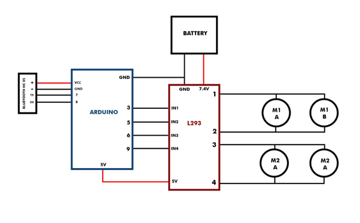
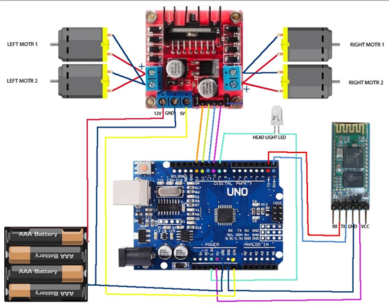
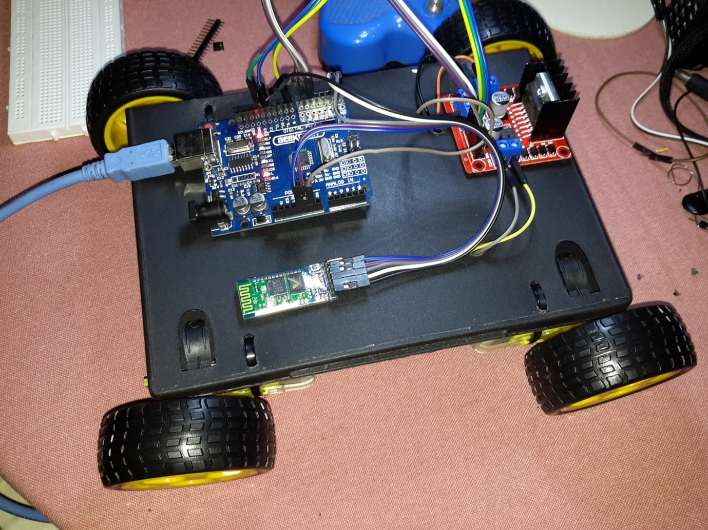

# Information about BT Robotic Car Project

Most of we might know about the robotics project and its working using microcontrollers. In today’s time, such DIY robotics projects are so popular and most demanded. Hence, we decided to make a new Robotic project Bluetooth controlled robot car using Arduino which is very simple and perfectly compatible with students, hobbyists, and beginners in embedded Technology. By adding more technology, these are a type of futuristic robots that will be used for different purposes in different sectors like firefighting bots, surveillance robots, etc.
In this project, we make a wirelessly Bluetooth controlled robot car using Arduino as the microcontroller. It will be an exciting project which is a combination of wireless communication, robotics, and electronics. We can able to control the robot using our smartphone.

# Components

1. Jumper wires
2. Micro motors and Grippy wheels
3. Li-ion Battery 1000mAh
4. HC-05 Bluetooth Module
5. Dual H-Bridge motor drivers L298
6. Arduino

# Circuit Diagram





# Arduino Code

```
#include <SoftwareSerial.h>

int in1 = 3;
int in2 = 5;
int in3 = 6;
int in4 = 9;

SoftwareSerial mySerial(7, 8); // RX TX
char t;

void setup() {
    mySerial.begin(9600);
    Serial.begin(9600);

    pinMode(in1, OUTPUT);
    pinMode(in2, OUTPUT);
    pinMode(in3, OUTPUT);
    pinMode(in4, OUTPUT);
}

void loop() {
    if (mySerial.available()) {
        t = mySerial.read();
        Serial.write(t);

        if (t == 'f') { // Move forward
            digitalWrite(in1, 1);
            digitalWrite(in2, 0);
            digitalWrite(in3, 1);
            digitalWrite(in4, 0);
        }

        if (t == 'b') { // Move backward
            digitalWrite(in1, 0);
            digitalWrite(in2, 1);
            digitalWrite(in3, 0);
            digitalWrite(in4, 1);
        }

        if (t == 'r') { // Turn right
            digitalWrite(in1, 0);
            digitalWrite(in2, 1);
            digitalWrite(in3, 1);
            digitalWrite(in4, 0);
            delay(200);
            digitalWrite(in1, 0);
            digitalWrite(in2, 0);
            digitalWrite(in3, 0);
            digitalWrite(in4, 0);
        }

        if (t == 'l') { // Turn left
            digitalWrite(in1, 1);
            digitalWrite(in2, 0);
            digitalWrite(in3, 0);
            digitalWrite(in4, 1);
            delay(200);
            digitalWrite(in1, 0);
            digitalWrite(in2, 0);
            digitalWrite(in3, 0);
            digitalWrite(in4, 0);
        }

        if (t == 's') { // Stop
            digitalWrite(in1, 0);
            digitalWrite(in2, 0);
            digitalWrite(in3, 0);
            digitalWrite(in4, 0);
        }
    }
}

```

# Final Project



# Conclusion

The BT Robot Car project provided valuable hands-on experience in embedded systems, wireless communication, and robotics. By integrating Arduino with the HC-05 Bluetooth module and motor driver, the project demonstrated how to build a wirelessly controlled robotic vehicle. This project not only enhanced technical skills in hardware-software interfacing but also introduced key concepts in real-time control and troubleshooting. It lays a solid foundation for future developments in advanced robotics applications, such as surveillance and firefighting robots.
